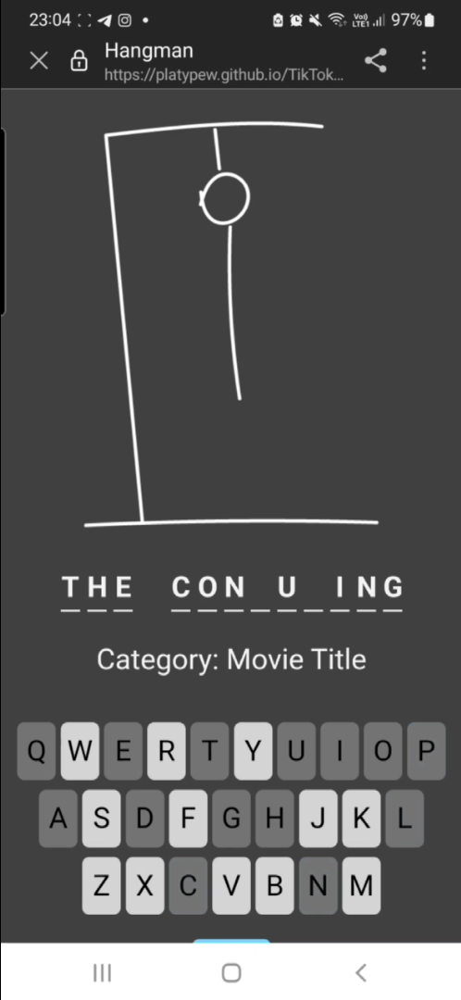
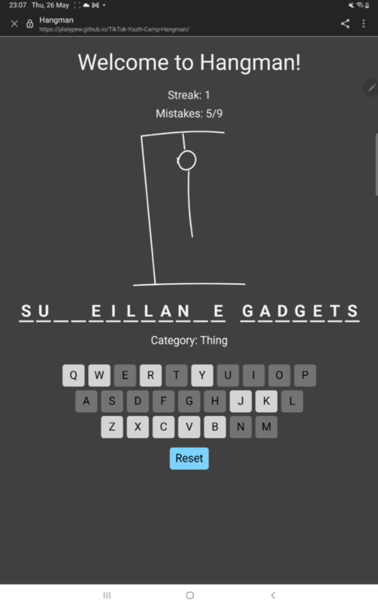
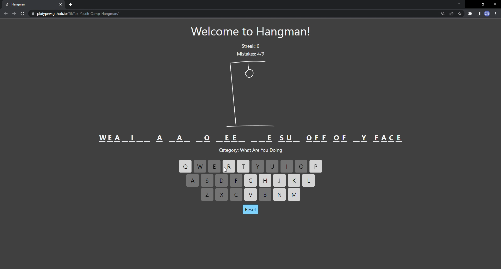

# TikTok Youth Camp Hangman Project


## Content

-   [The Team](#the-team)
-   [Short Description](#short-description)
-   [Directory Tree](#directory-tree)
-   [Instructions](#instructions)
-   [Project Report](#project-report)

## The Team

-   [@PlatyPew](https://github.com/PlatyPew)
-   [@asterblaster](https://github.com/asterblaster)
-   [@cnjoanne](https://github.com/cnjoanne)
-   [@huijuank](https://github.com/huijuank)
-   [@varunteja32](https://github.com/varunteja32)

## Short Description

This hangman game is powered by ReactJS and uses the TailwindCSS framework. It allows the player to guess a word, given a category and 9 failure attempts. The streak score of the player will be calculated.

### Screenshots





### Video

[](https://youtu.be/AxaYkcasI_s "TikTok Hangman Project")

## Directory Tree

```
LICENSE
package-lock.json
package.json
postcss.config.js
public
├── favicon.ico
├── images
│  ├── asset-0.png
│  ├── asset-1.png
│  ├── asset-2.png
│  ├── asset-3.png
│  ├── asset-4.png
│  ├── asset-5.png
│  ├── asset-6.png
│  ├── asset-7.png
│  ├── asset-8.png
│  └── asset-9.png
├── index.html
├── manifest.json
└── robots.txt
README.md
src
├── App.css
├── App.js
├── App.test.js
├── index.css
├── index.js
├── Keyboard.css
├── Keyboard.js
├── logo.svg
├── Phrase.css
├── Phrase.js
├── reportWebVitals.js
├── setupTests.js
└── WordBank
   ├── aroundthehouse.js
   ├── beforeandafter.js
   ├── event.js
   ├── fictionalcharacter.js
   ├── foodanddrink.js
   ├── funandgames.js
   ├── inthekitchen.js
   ├── landmark.js
   ├── livingthing.js
   ├── movietitle.js
   ├── occupation.js
   ├── people.js
   ├── place.js
   ├── randomword.js
   ├── thing.js
   └── whatareyoudoing.js
tailwind.config.js
```

The key JavaScript and CSS files used during development of the hangman game can be found [here](src/)

## Instructions

#### Hosted website

The hangman game is hosted on GitHub pages Visit [this link](https://platypew.github.io/tiktok-youth-camp-hangman/) to start playing the game immediately.

#### Available scripts

To run the hangman game in the development mode, run the command `npm start`.

To create a production bundle for the hangman game, run the command `npm run build`.
